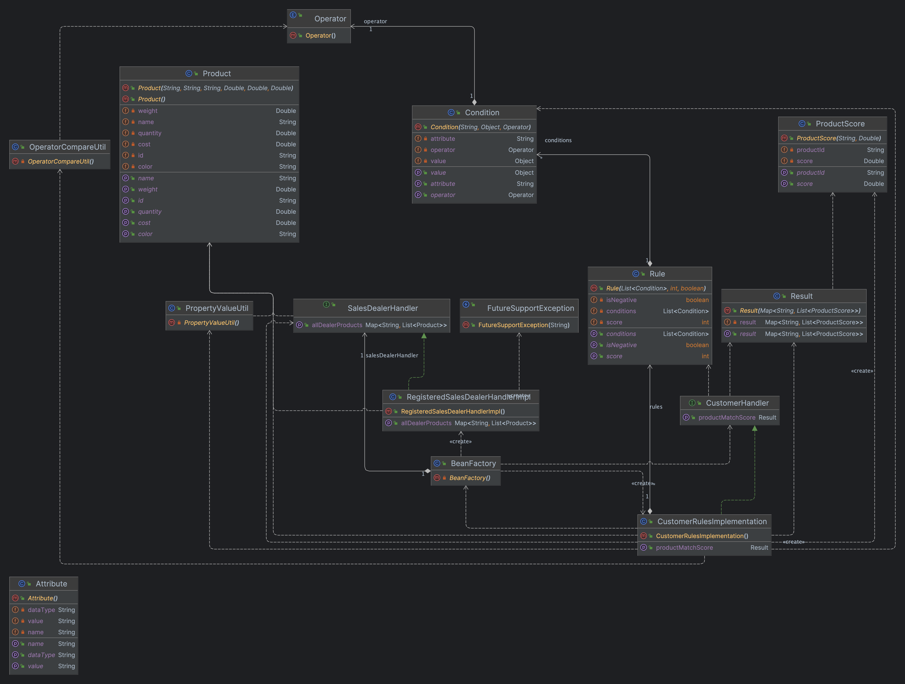

### Problem statement that is being focused?
#### Scope:
- Company trying to buy the products
- Rules
- Rule engine
- Product with scores derived using rules
- Total price 
- Average price
- simple class hierarchy
- Interface first 
- simple test cases to talk further on the approach
- simple case

#### Out of scope: 
- E2E solution
- Enterprise solution
- Edge cases and scenarios 
- registering the dealers and customer/company 
- registering the product schema

### Assumptions:
To solve this problem, I have made the following assumptions:

1. The set of attributes used to describe each product is limited, complete & accurate.
2. The data types of each attribute are correctly specified, and the comparison operators used in the rules are compatible with the data types.
3. The rules specified by the company are complete and unambiguous, and the scoring system is well-defined.
4. The product attributes and rules are consistent with each other, and any negative rules are simple subtractions from total score.
5. The scoring system takes into account the conditions that must be met for each rule, and the percentage of conditions that match is accurately calculated.
6. The threshold used to filter the products is well-defined and consistent with the scoring system. No Negative threshold is supplied. 
7. The calculation of the total and average prices for the products that score sufficiently highly is accurate and does not consider account any discounts or other factors that may affect the final price.
8. The product system is single placeholder whereas company is multiple users. 
9. The product schema and company rules are already aligned and no error tracking considered.

### How to set up and verify?
- JDK - 17.0
- Maven - Apache Maven 3.8.7
- It has only one test case class so, Please feel to run
```shell
mvn test
```

UML diagram: 


Relationship in the diagram most mattered is between models. 
Services are more of solution to excerise. 


